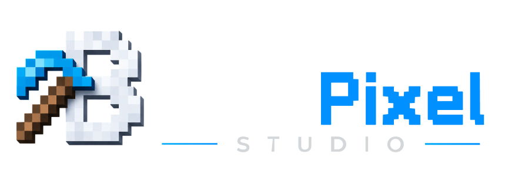
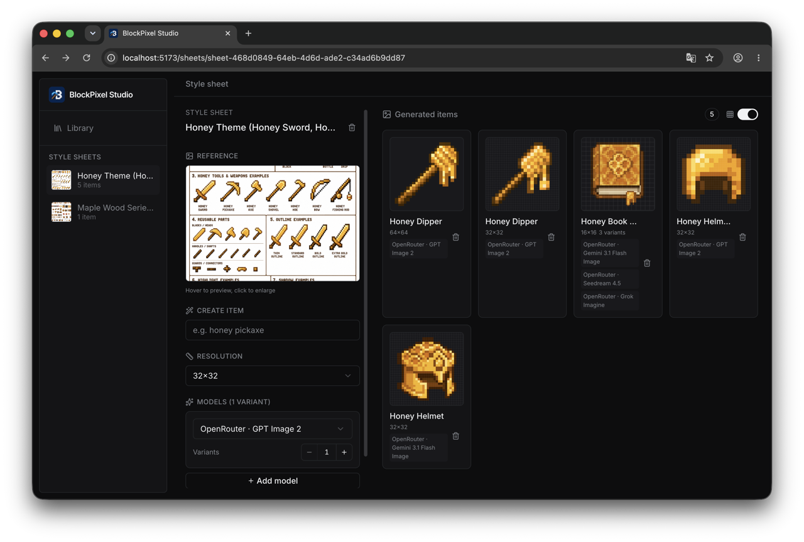
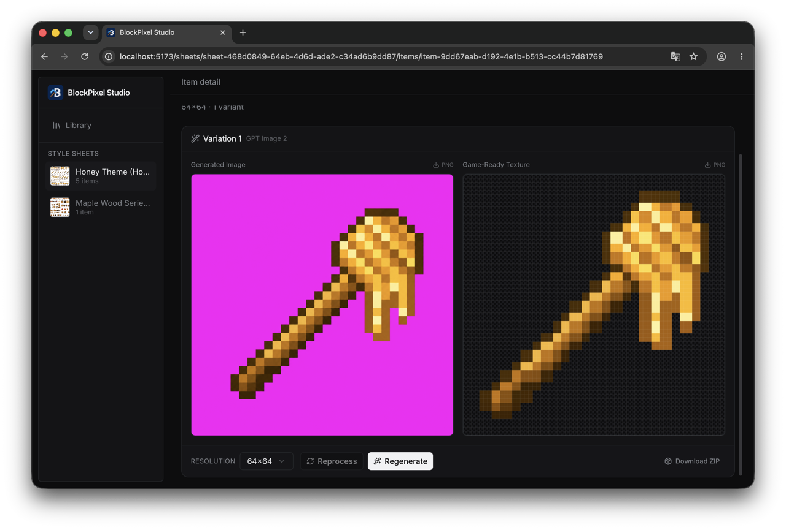

<p align="center">
  
</p>

# BlockPixel Studio

**AI-powered Minecraft item texture generation studio.**

BlockPixel Studio helps Minecraft modders, resource-pack creators, and pixel-art makers generate consistent item textures from a prompt-driven workflow: create a style sheet, use it as a reference, then turn individual AI generations into game-ready pixel textures.



## Why BlockPixel Studio?

General-purpose image models can produce beautiful concepts, but they often fail at the details that matter for Minecraft textures:

- inconsistent style across a set of items
- oversized or blurry shapes
- fake pixel art instead of clean low-resolution sprites
- backgrounds that need manual cleanup
- repeated copy/paste work when generating variants

BlockPixel Studio is built around a more practical workflow for texture production:

1. Generate a **style reference sheet** from a theme prompt.
2. Generate individual items using that reference style.
3. Compare the **original AI image** with the **processed game-ready texture**.
4. Download PNG or ZIP outputs for use in your project.

## Features

- **Style sheet generation** — create a reference sheet for a full item set or theme.
- **Reference-guided item generation** — generate new items that follow the selected style sheet.
- **Original vs processed comparison** — inspect the raw AI output next to the game-ready texture.
- **Pixel-art post-processing** — convert AI output into cleaner Minecraft-friendly PNGs.
- **Multiple model support** — configure OpenAI-compatible providers and OpenRouter models.
- **Variant generation** — generate multiple variants per item, including across different models.
- **Local-first storage** — generated images and metadata are saved under `generated/`.
- **PNG and ZIP downloads** — export individual textures or packaged outputs.

## Screenshot: Item Detail



## Tech Stack

- **Frontend:** React, Vite, TypeScript
- **Backend:** Fastify
- **Image processing:** Sharp, proper-pixel-art-ts
- **Storage:** local filesystem
- **Package manager:** pnpm

## Requirements

- Node.js 22+
- pnpm
- An image generation API key, such as OpenAI or OpenRouter

## Quick Start

```bash
pnpm install
cp config/models.example.yaml config/models.yaml
pnpm dev
```

Open the app at:

```txt
http://localhost:5173
```

The Fastify API server runs locally alongside the Vite frontend.

## Configure Image Models

BlockPixel Studio reads model/provider settings from:

```txt
config/models.yaml
```

Start from the example file:

```bash
cp config/models.example.yaml config/models.yaml
```

Example configuration:

```yaml
defaultProviderId: openrouter
providers:
  - id: openrouter
    displayName: OpenRouter
    type: openrouter
    apiKey: YOUR_OPENROUTER_API_KEY
    defaultModel: openai/gpt-image-2
    models:
      - id: openai/gpt-image-2
        displayName: GPT Image 2
        resolution: 1K
      - id: google/gemini-3.1-flash-image-preview
        displayName: Gemini 3.1 Flash Image
        resolution: 1K
        outputFormat: jpeg
```

You can also configure an OpenAI-compatible provider directly:

```yaml
providers:
  - id: openai
    displayName: OpenAI Direct
    type: openai-compatible
    apiKey: YOUR_OPENAI_API_KEY
    defaultModel: gpt-image-2
    models:
      - id: gpt-image-2
        displayName: GPT Image 2
```

## Development

Run the frontend and backend together:

```bash
pnpm dev
```

Type-check the project:

```bash
pnpm tsc --noEmit
```

Build for production:

```bash
pnpm build
```

Lint:

```bash
pnpm lint
```

## Project Structure

```txt
src/          React frontend
server/       Fastify API server and image pipeline
config/       model/provider configuration
generated/    locally generated sheets, items, and metadata
public/       static assets
scripts/      utility scripts
```

## Generated Output

Generated assets are saved locally under:

```txt
generated/sheets/
```

Each sheet can contain:

- `metadata.json`
- the generated reference image
- item metadata
- original AI images
- processed game-ready textures

## Roadmap

BlockPixel Studio is in early development. Planned areas include:

- better resource-pack export workflows
- more controllable post-processing options
- reference upload support
- local history improvements
- preset prompts for common Minecraft materials and item families

## Contributing

Issues, ideas, and pull requests are welcome. Since the project is still early, please keep contributions focused and practical.

Good first areas to help with:

- UI polish
- image post-processing quality
- model/provider compatibility
- export workflows
- documentation

## License

AGPL-3.0-only
